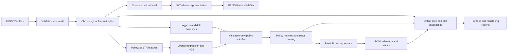

# Architecture

## System View



## Data Ingestion

`feed_ranking_ops.data` parses MIND `news.tsv` and `behaviors.tsv`, validates nested candidate
labels and histories, audits source quality, and writes typed Parquet artifacts. The default
protocol uses official train/dev sources. The explicit train-only protocol applies a stable
chronological 70/15/15 split using timestamp, source row, and impression ID.

No behavior row is divided across partitions. Histories are copied from the source row and
are never reconstructed with future clicks.

## Logged-Candidate Evaluation

`feed_ranking_ops.evaluation` ranks only candidates already shown in a logged impression.
It implements original order, global popularity, time-decayed popularity, category affinity,
and TF-IDF history similarity. Metrics are grouped by impression and use source candidate
position as the deterministic tie-breaker.

This path measures re-ranking within logged exposure, not full-catalog retrieval.

## Retrieval

The exact path constructs a sparse TF-IDF article matrix, builds history profiles, applies
observed-availability and history-exclusion rules, and scores the eligible catalog exactly.
It is retained as a bounded correctness reference.

The ANN path projects article vectors with deterministic TruncatedSVD and builds FAISS inner
product indexes. Batched profile search avoids one FAISS call per query. Full comparison mode
supports dense exact references; fast ANN-only mode intentionally skips approximation recall
and says so in its protocol.

## Learning To Rank

`feed_ranking_ops.ranking` explodes logged candidates into pointwise rows. Explainable
features combine source position, prior-only popularity, category/subcategory history,
TF-IDF similarity, history quality, and article metadata.

Training popularity features process impressions chronologically and update state only after
the current impression is featurized. Validation artifacts fit on train; final artifacts fit
on train plus validation.

## Policy Selection

The promotion layer reads baseline and LTR reports. It ranks validation candidates by
NDCG@10, MRR, AUC, then name. A learned model must improve validation NDCG@10 by at least 3%
relative to the strongest baseline.

Internal-test metrics are copied into the report only after selection. The current HGB lift
is 2.77%, so category affinity remains the serving policy.

## Serving

The serving package consists of:

```text
artifacts/serving/
  policy_manifest.json
  news_catalog.parquet
```

The manifest records schema versions, policy configuration, fitting partitions, metrics,
promotion evidence, protocol, limitations, and relative artifact paths. The catalog contains
only news ID, category, and subcategory.

FastAPI loads and validates both artifacts once during lifespan startup. `/rank` uses the
same category-affinity scorer as offline monitoring. Unknown IDs are explicit; score ties
preserve caller candidate order.

## Observability

Optional JSONL telemetry contains request/response counts, latency, warnings, outcomes, and
top-result category aggregates, not raw news IDs. `/metrics` holds bounded process-local
latencies and aggregate quality counters.

Offline monitoring scores validation/test using the packaged policy, reports behavior
slices, and compares distributions with a training reference using Jensen-Shannon divergence
and absolute rate differences.

## Generated Versus Tracked

Raw data, processed Parquet, prediction files, serving artifacts, request logs, and generated
experiment reports are ignored by Git. The small deterministic portfolio JSON/Markdown
snapshot is tracked. Source, tests, documentation, and release scripts are tracked.

## Runtime Boundaries

- Exact retrieval and monitoring are CPU-only.
- FAISS is optional and isolated in the `ann` dependency extra.
- The API requires a mounted or locally generated serving manifest and catalog.
- No online feature store, queue, cache, or external database is assumed.
